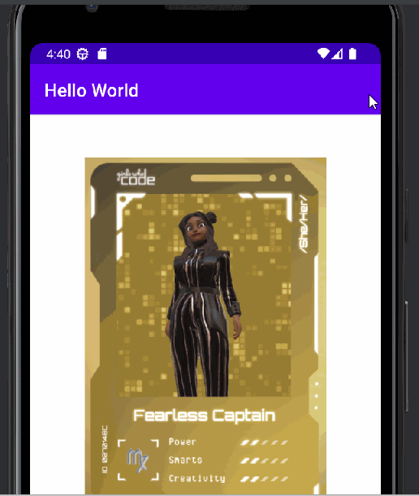

# Android Prework - *Hello World*

Submitted by: **Alexandra Wonyu**

**Hello World** is an android app that shows an image and introductory message, and allows pressing a button to display a Toast. 

Time spent: **3** hours spent in total

## Required Features

The following **required** functionality is completed:

* [X] Image and introductory message displayed on screen
* [X] Button displayed on screen
* [X] Toast with message appears when button is pressed 

The following **optional** features are implemented:

* [X] Changed text colour to red by adding a resource for the colour red in `res/colors.xml`
* [X] Used a string resource instead of a hard-coded string for the toast message, adding a string resource in `res/strings.xml` and retrieving it using Kotlin notation in `MainActivity.kt`

## Video Walkthrough

Here's a walkthrough of implemented features:

GIF created with LICEcap

## Notes

I did not encounter any particular challenge, but since this is all so new to me, I had fun reading the guides provided and I am excited to learn more about Android development.

## License

    Copyright 2022 CodePath, Alexandra Wonyu

    Licensed under the Apache License, Version 2.0 (the "License");
    you may not use this file except in compliance with the License.
    You may obtain a copy of the License at

        http://www.apache.org/licenses/LICENSE-2.0

    Unless required by applicable law or agreed to in writing, software
    distributed under the License is distributed on an "AS IS" BASIS,
    WITHOUT WARRANTIES OR CONDITIONS OF ANY KIND, either express or implied.
    See the License for the specific language governing permissions and
    limitations under the License.